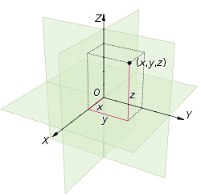
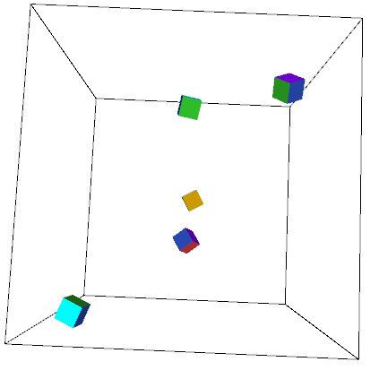
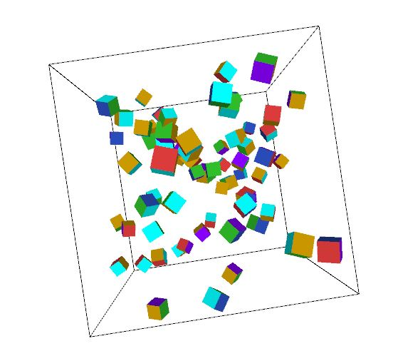

<section id="themes">
	<h2>Themes</h2>
		<p>
			Set your presentation theme: <br>
			<!-- Hacks to swap themes after the page has loaded. Not flexible and only intended for the reveal.js demo deck. -->
                        <a href="#" onclick="document.getElementById('theme').setAttribute('href','css/theme/black.css'); return false;">Black (default)</a> -
			<a href="#" onclick="document.getElementById('theme').setAttribute('href','css/theme/white.css'); return false;">White</a> -
			<a href="#" onclick="document.getElementById('theme').setAttribute('href','css/theme/league.css'); return false;">League</a> -
			<a href="#" onclick="document.getElementById('theme').setAttribute('href','css/theme/sky.css'); return false;">Sky</a> -
			<a href="#" onclick="document.getElementById('theme').setAttribute('href','css/theme/beige.css'); return false;">Beige</a> -
			<a href="#" onclick="document.getElementById('theme').setAttribute('href','css/theme/simple.css'); return false;">Simple</a> <br>
			<a href="#" onclick="document.getElementById('theme').setAttribute('href','css/theme/serif.css'); return false;">Serif</a> -
			<a href="#" onclick="document.getElementById('theme').setAttribute('href','css/theme/blood.css'); return false;">Blood</a> -
			<a href="#" onclick="document.getElementById('theme').setAttribute('href','css/theme/night.css'); return false;">Night</a> -
			<a href="#" onclick="document.getElementById('theme').setAttribute('href','css/theme/moon.css'); return false;">Moon</a> -
			<a href="#" onclick="document.getElementById('theme').setAttribute('href','css/theme/solarized.css'); return false;">Solarized</a>
		</p>
</section>

H:

# Transformations demo

Juan Manuel Cuestas Beltrán

H:

## Index

 1. Goal<!-- .element: class="fragment" data-fragment-index="1"-->
 2. Design<!-- .element: class="fragment" data-fragment-index="2"-->
 3. Interaction<!-- .element: class="fragment" data-fragment-index="3"-->
 4. Demo<!-- .element: class="fragment" data-fragment-index="4"-->
 5. Conclusions<!-- .element: class="fragment" data-fragment-index="5"-->
 6. Questions<!-- .element: class="fragment" data-fragment-index="6"-->

H:

## Goal

* Apply some transformations in R3, such as translation and rotation to analyze the nature of the code of these transformations using Processing and some of its methods to apply them.
* Motivation: Understand and apply computationally some of the transformations in space R3.
<center></center>
H:

## Design
```processing
									 				World
													  ^
													  |
													 L1
													  ^
													/ | \
												   /  |  \   
												  /   |   \
											     L2  L3...Ln
```
* Where L1 is the external cube and L2 to Ln are the cubes moving, rotating and bouncing inside L1.
* The transformations are implemented with default shader.
* The Sketch is based on some examples from the book "Processsing: Creative Coding And Computational Art - Ira Greenberg".


V:

## Design
* One class is used to run the Sketch: Cube, wich describes the cube vertices to create the inner cubes in the Sketch, and its used to create the external cube too.
* The internal cubes are created randomly with a size from from 20 to 30.
H:

## Interaction


The external cube and inner cubes are always rotating by itself to show the transformations. The user can modify the number of internal cubes, with number keys, being 1 the less number of cubes, and 6 the largest number for the "cubies".



H:

## Demo
<canvas data-processing-sources="sketches/sketches.pde"></canvas>
<script type="sketches/sketches.pde" src="processing.js"></script>

V:

## Demo
### Example

Example of an online demo

<div id='minimap_id'></div>

H:

## Conclusions

* Thinking in 3D space is definitely more confusing than in 2D.
* The default Poccessing functions make things easier, but It’s valuable to understand how these functions operate on the space.


H:

## Questions

?

H:

## References

* Processsing: Creative Coding And Computational Art - Ira Greenberg

* [Math primer for graphics and game development](https://tfetimes.com/wp-content/uploads/2015/04/F.Dunn-I.Parberry-3D-Math-Primer-for-Graphics-and-Game-Development.pdf)
